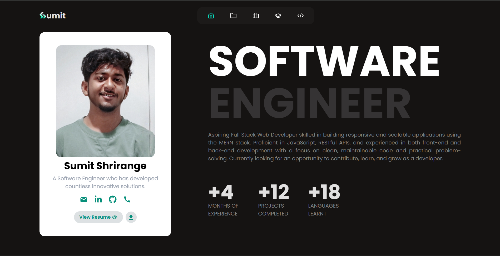
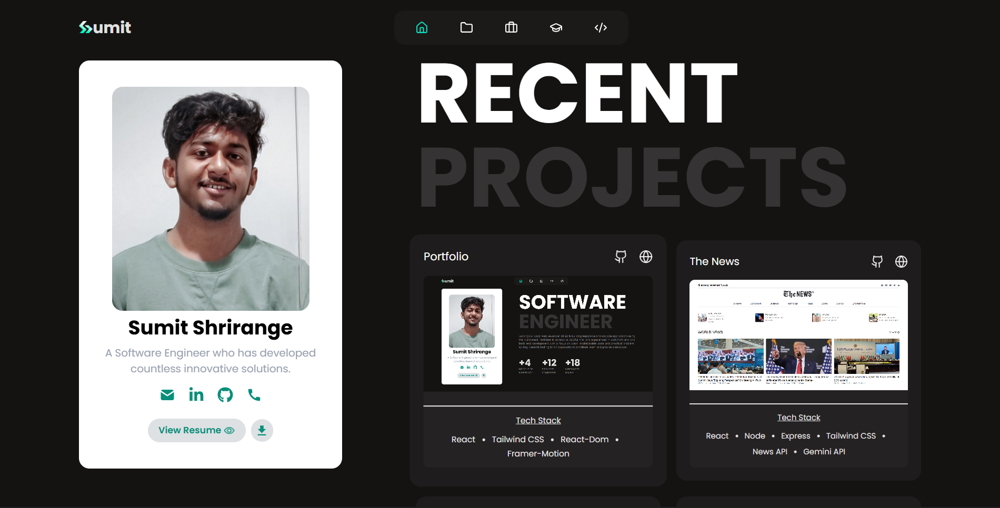
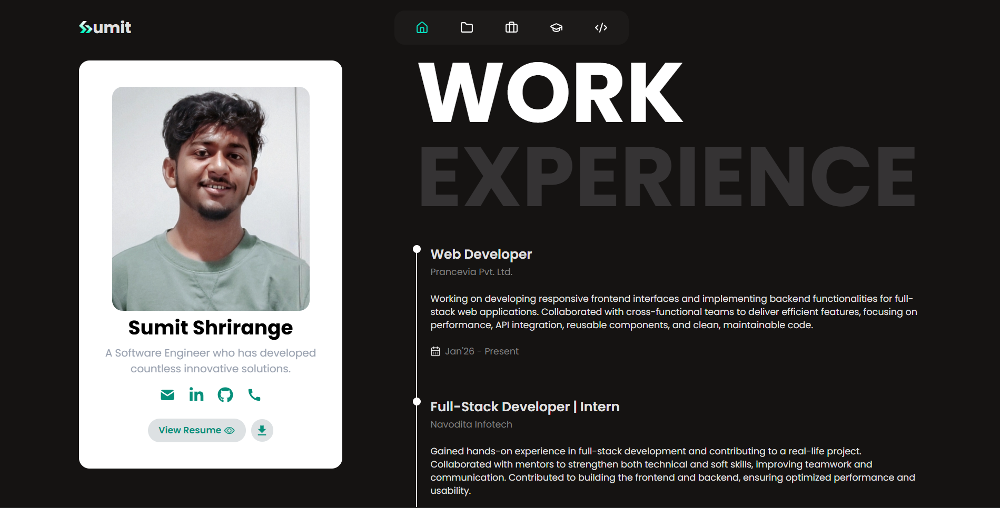
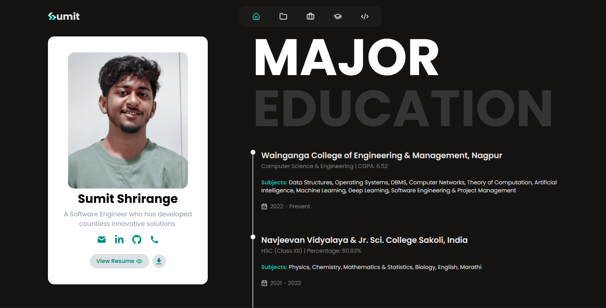
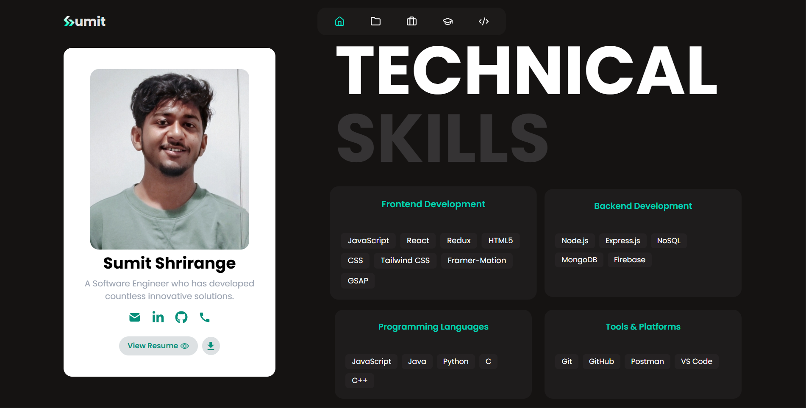
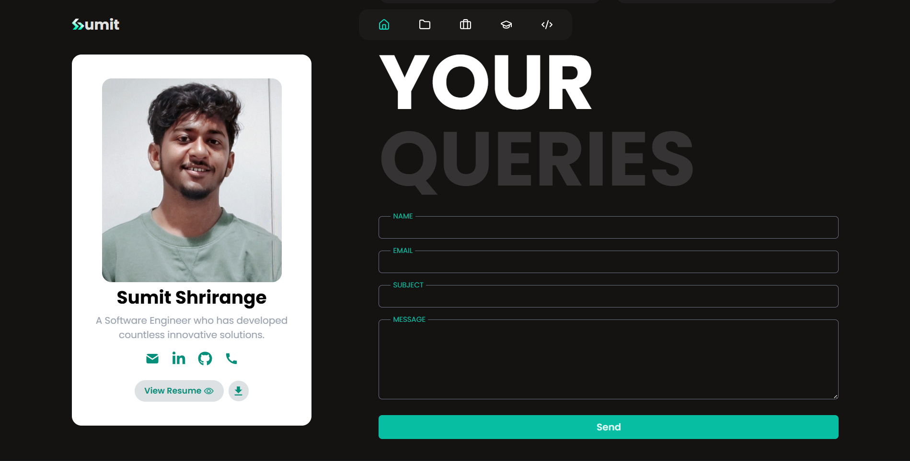

# Personal Portfolio Website

## Overview

This Personal Portfolio Website is a modern, responsive web application designed to showcase my professional profile, skills, projects, and experience as a Software Engineer / Full-Stack Web Developer. It serves as a central platform for recruiters, clients, and collaborators to learn about my work and easily get in touch.

The portfolio focuses on clean UI, performance, SEO optimization, and scalability, following production-level web development standards.

## The Problem

Many developers rely on scattered profiles across platforms, which leads to:

* Incomplete representation of skills and projects
* Poor first impressions due to unoptimized UI/UX
* Lack of SEO visibility
* Difficulty for recruiters to contact or evaluate work quickly

A personal brand requires a single, well-structured digital presence.


## The Solution

This portfolio website provides a centralized and professional digital identity with:

* Clear presentation of skills and experience
* Dedicated project showcase
* Optimized SEO using metadata and semantic HTML
* Responsive design for all screen sizes
* Fast performance and clean navigation
* Easy access to resume and contact details

The goal is to make a strong first impression and simplify recruiter engagement.

## Features

* Responsive and modern UI
* Home, Projects, Experience, Education, Skills, and Contact sections
* SEO-friendly meta tags using React Helmet
* Reusable and scalable component architecture
* Smooth navigation and optimized performance
* Deployed and production-ready setup

## Tech Stack

### Frontend

* React.js
* React Router
* JavaScript (ES6+)
* Tailwind CSS
* Framer Motion
* React Helmet Async

### Deployment

* Vercel

## Environment Setup

### Clone the Repository

```bash
git clone https://github.com/sumitshrirange/portfolio.git
```

**Home Page**



**Projects Page**



**Experience Page**



**Education Page**



**Skills Page**



**Contact Page**




## Author

### Sumit Shrirange
#### Software Engineer | Full-Stack Web Developer

* Portfolio: https://sumit-shrirange.vercel.app/
* GitHub: https://github.com/sumitshrirange/
* LinkedIn: https://www.linkedin.com/in/sumitshrirange/